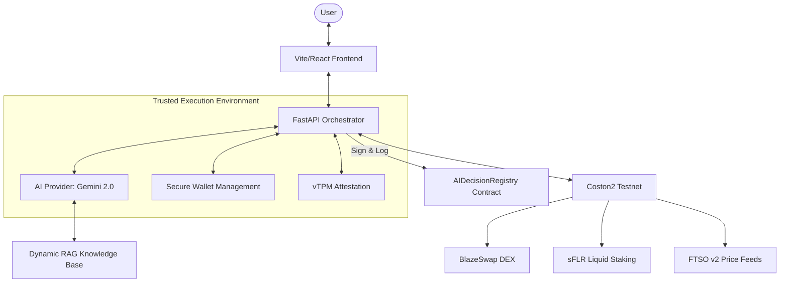

# Flint: The Trust Layer for AI-Native DeFi on Flare

Flint is an institutional-grade AI Agent platform engineered for the Flare Network. It establishes a secure and verifiable "Trust Layer" that enables autonomous AI agents to execute complex decentralized finance (DeFi) operations within a Trusted Execution Environment (TEE). By bridging high-level AI reasoning with hardware-level security, Flint ensures that autonomous financial decisions are both private and provably authentic.

## System Architecture

The interaction between the core components of the Flint ecosystem, from user interaction to on-chain execution, is detailed in the architecture diagram below.



---

## Core Security Pillars

Flint's "Trust Layer" is built upon four fundamental technical pillars:

| Pillar              | Technology         | Functional Guarantee                                                                       |
| :------------------ | :----------------- | :----------------------------------------------------------------------------------------- |
| **Confidentiality** | TEE (AMD SEV)      | Ensures that AI reasoning and private keys are never exposed to the host machine.          |
| **Verifiability**   | Remote Attestation | Provides hardware-level proof that the code running in the TEE is untampered.              |
| **Integrity**       | Decision Logging   | Every significant AI action is cryptographically signed and recorded on the Flare Network. |
| **Truth**           | FTSO v2            | All price-sensitive decisions are anchored to Flare's native, decentralized price oracle.  |

---

## Technical Specifications & Contract Addresses (Coston2 Testnet)

Flint is currently optimized for the **Coston2 Testnet**. Below are the primary contract addresses utilized by the platform for testing and verification.

### Core Protocol Contracts

| Component           | Network | Address                                      |
| :------------------ | :------ | :------------------------------------------- |
| **Decision Logger** | Coston2 | `0x6eC6F9d2e69E5569ffCf9fe8Bff4848aEca8f573` |

### DeFi Integration (BlazeSwap & Staking)

| Contract / Token           | Network | Address                                      |
| :------------------------- | :------ | :------------------------------------------- |
| **BlazeSwap Router**       | Coston2 | `0x56a6552B5a9351C83A354C9359e9C179471f0084` |
| **BlazeSwap Factory**      | Coston2 | `0xf8866E8783451FE5A24Bde49e0839eD068307270` |
| **sFLR Staking**           | Coston2 | `0x12e605bc104e93B45e1aD99F9e555f659051c2BB` |
| **Wrapped C2FLR (WC2FLR)** | Coston2 | `0xC67DCE33D7A8efA5FfEB961899C73fe01bCe9273` |

---

## Operational Use Cases

Flint is designed to handle a diverse range of autonomous and semi-autonomous DeFi scenarios.

| Scenario                  | AI Action                                                  | Outcome                                                      |
| :------------------------ | :--------------------------------------------------------- | :----------------------------------------------------------- |
| **Portfolio Rebalancing** | Analyzes external TradFi screenshots (e.g., Robinhood).    | Recommends and executes a matching DeFi allocation on Flare. |
| **Yield Optimization**    | Monitors staking rewards and FTSO prices.                  | Automatically stakes FLR into sFLR when optimal.             |
| **Intelligent Swaps**     | Classifies natural language intent (e.g., "Swap 100 FLR"). | Executes swaps via BlazeSwap with EIP-1559 gas optimization. |
| **Audit & Compliance**    | Generates signed decision packets for every tx.            | Provides an immutable trail for institutional reporting.     |

---

## Installation & Deployment Guide

### 1. Prerequisites

- Python 3.12 or higher
- Node.js 18.x or higher
- `uv` package manager (recommended for Python)
- Docker (for TEE deployment)

### 2. Backend Installation

```bash
# Clone the repository
git clone https://github.com/REPLACE_WITH_ORG/flint.git
cd flint

# Synchronize dependencies
uv sync --all-extras

# Configure environment
cp .env.example .env
# Edit .env with your Gemini API Key and RPC details (Coston2)
```

### 3. Frontend Installation

```bash
cd frontend
npm install
npm run dev
```

### 4. TEE Deployment (Confidential Space)

Flint is optimized for deployment within Google Cloud Confidential Space using AMD SEV technology.

```bash
# Build the production TEE image
docker build -t flint-tee .

# Run locally for testing (Amd SEV simulation)
docker-compose up
```

---

## License

This project is licensed under the Apache 2.0 License. See the [LICENSE](LICENSE) file for details.

---

_Built with precision for the [Flare Network](https://flare.network)._
