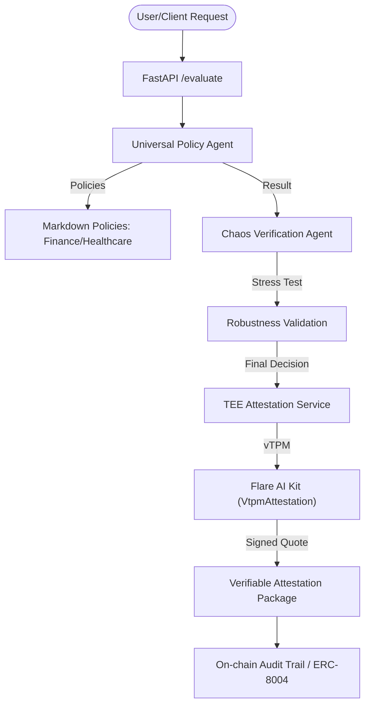

# FLINT Architecture: Verifiable AI Trust Layer

## Overview
FLINT provides a sector-agnostic Trust Layer for AI agents, ensuring that every decision is verifiable, compliant, and robust. It leverages Flare Network's infrastructure for data integrity and TEE (Trusted Execution Environment) for secure execution.

## Core Components

### 1. Risk & Policy Agent (PydanticAI)
- **Location:** [agent.py](file:///Users/kunal/Desktop/code/flint/packages/ai/src/agent.py)
- **Role:** Evaluates DeFi yield strategies or generic requests against specific policies.
- **Framework:** Uses PydanticAI (based on Logfire and Gemini) for structured, typed AI responses.
- **Integration:** Directly uses Flare AI Kit ecosystem tools specifically `get_ftso_latest_price` for real-time FTSO (Flare Time Series Oracle) data.

### 2. Universal Trust Agent
- **Location:** [universal_agent.py](file:///Users/kunal/Desktop/code/flint/packages/ai/src/universal_agent.py)
- **Role:** A generalized agent for cross-sector policy evaluation (Finance, Healthcare, etc.).
- **Reputation:** Integrates with ChaosChain patterns (ERC-8004) to maintain an on-chain audit trail of computation hashes.

### 3. TEE & Attestation Service
- **Location:** [attestation.py](file:///Users/kunal/Desktop/code/flint/packages/ai/src/attestation.py)
- **Role:** Generates hardware-bound cryptographic attestations using Flare AI Kit's `VtpmAttestation` client.
- **Verifiability:** Binds AI decision hashes to vTPM quotes, ensuring the code was executed in a secure Intel TDX enclave (GCP Confidential Space).

### 4. Chaos Verification Agent
- **Location:** `packages/ai/src/chaos_agent.py`
- **Role:** Stress-tests AI decisions against adversarial scenarios (inspired by ChaosChain).

## Integration points (Flare AI Kit)
- **vTPM Client:** Used for Ra-TLS and hardware attestation via [VtpmAttestation](file:///Users/kunal/Desktop/code/flint/packages/ai/src/attestation.py).
- **FTSO Tools:** Used for real-time, decentralized price feeds via [get_ftso_latest_price](file:///Users/kunal/Desktop/code/flint/packages/ai/src/agent.py).
- **FDC Integration (Ongoing):** For cross-chain data verification.

## Data Flow
1. **Input:** Strategy/Request + Context (Portfolio/Market/Patient Data).
2. **Policy Fetch:** Loads Markdown-based policy rules (e.g., `src/policies/finance_v1.md`).
3. **Evaluation:** `UniversalPolicyAgent` generates a decision.
4. **Chaos Check:** `ChaosVerificationAgent` stress-tests the decision.
5. **Attestation:** `FlareAttestationService` binds the final result to a hardware quote.
6. **Output:** Verifiable Decision Package (Decision + Attestation).
