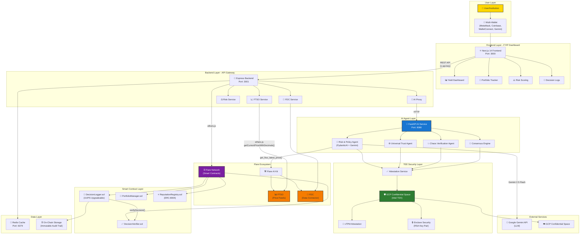
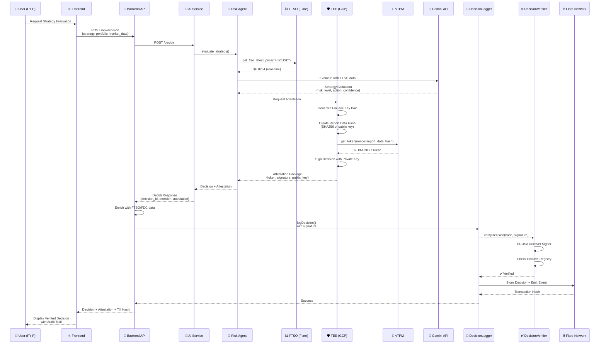
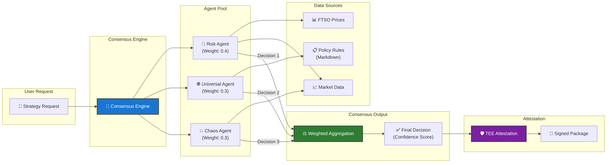
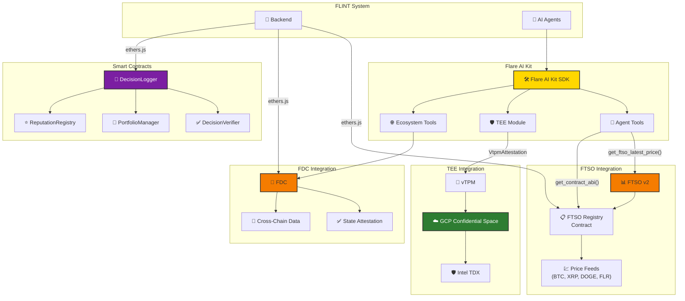
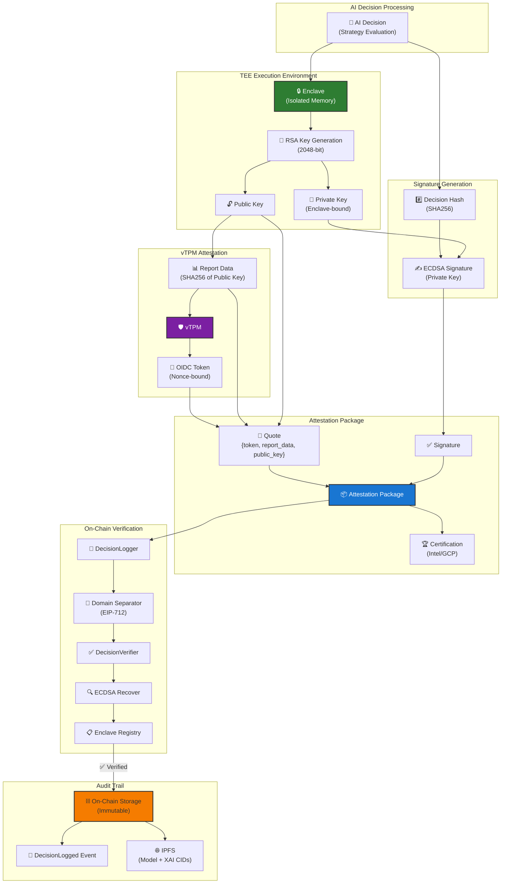
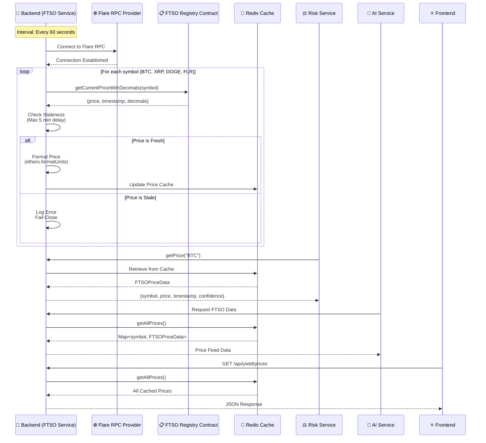
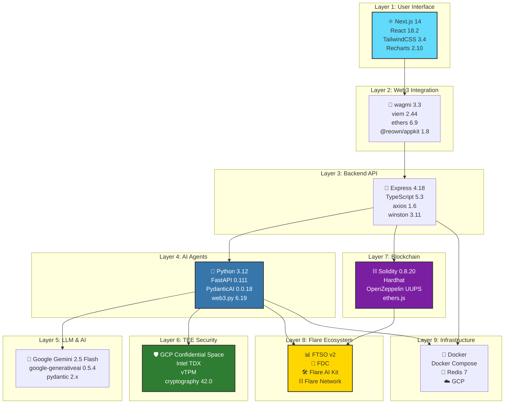

# FLINT System Architecture Diagrams

## 1. High-Level System Architecture

---

## 2. AI Decision Flow with TEE Attestation

---

## 3. Multi-Agent Consensus Flow

---

## 4. Flare Ecosystem Integration Map

---

## 5. Security & Attestation Architecture

---

## 6. Data Flow: FTSO Price Feed Integration

---

## 7. Technology Stack Layers

---

## Summary

These diagrams visualize the complete FLINT architecture, showing:

1. **System Architecture** - All components and their interactions
2. **Decision Flow** - Step-by-step AI decision processing with TEE attestation
3. **Consensus Mechanism** - Multi-agent decision aggregation
4. **Flare Integration** - How FTSO, FDC, and Flare AI Kit are used
5. **Security Model** - TEE execution and on-chain verification
6. **FTSO Data Flow** - Real-time price feed integration
7. **Technology Stack** - Layer-by-layer technology breakdown

**Key Highlights:**
- ✅ Verifiable AI via TEE (GCP Confidential Space)
- ✅ Multi-agent consensus prevents bias
- ✅ On-chain audit trail (DecisionLogger)
- ✅ Real-time FTSO price feeds
- ✅ FDC cross-chain verification
- ✅ Flare AI Kit deep integration
- ✅ Institutional-grade security (vTPM attestation)
