# FLINT System Architecture Diagrams

## 1. High-Level System Architecture

```mermaid
graph TB
    subgraph "User Layer"
        User["👤 User/Institution"]
        Wallet["🔐 Multi-Wallet<br/>(MetaMask, Coinbase,<br/>WalletConnect, Gemini)"]
    end

    subgraph "Frontend Layer - FYIP Dashboard"
        Frontend["⚛️ Next.js 14 Frontend<br/>Port: 3000"]
        YieldDash["📊 Yield Dashboard"]
        Portfolio["💼 Portfolio Tracker"]
        RiskScore["⚠️ Risk Scoring"]
        DecisionLog["📝 Decision Logs"]
    end

    subgraph "Backend Layer - API Gateway"
        Backend["🔧 Express Backend<br/>Port: 3001"]
        FTSO_Svc["📈 FTSO Service"]
        FDC_Svc["🔗 FDC Service"]
        Risk_Svc["⚖️ Risk Service"]
        AI_Proxy["🤖 AI Proxy"]
    end

    subgraph "AI Agent Layer"
        AI["🐍 FastAPI AI Service<br/>Port: 8080"]
        RiskAgent["🎯 Risk & Policy Agent<br/>(PydanticAI + Gemini)"]
        UniversalAgent["🌐 Universal Trust Agent"]
        ChaosAgent["💥 Chaos Verification Agent"]
        ConsensusEngine["🤝 Consensus Engine"]
    end

    subgraph "TEE Security Layer"
        TEE["🛡️ GCP Confidential Space<br/>(Intel TDX)"]
        vTPM["🔐 vTPM Attestation"]
        Enclave["🔒 Enclave Security<br/>(RSA Key Pair)"]
        AttestSvc["✅ Attestation Service"]
    end

    subgraph "Flare Ecosystem"
        FTSO["📊 FTSO<br/>(Price Feeds)"]
        FDC["🔗 FDC<br/>(Data Connector)"]
        FlareKit["🛠️ Flare AI Kit"]
        FlareNet["⛓️ Flare Network<br/>(Smart Contracts)"]
    end

    subgraph "Smart Contract Layer"
        DecisionLogger["📜 DecisionLogger.sol<br/>(UUPS Upgradeable)"]
        DecisionVerifier["✅ DecisionVerifier.sol"]
        PortfolioMgr["💼 PortfolioManager.sol"]
        ReputationReg["⭐ ReputationRegistry.sol<br/>(ERC-8004)"]
    end

    subgraph "Data Layer"
        Redis["💾 Redis Cache<br/>Port: 6379"]
        OnChain["⛓️ On-Chain Storage<br/>(Immutable Audit Trail)"]
    end

    subgraph "External Services"
        Gemini["🤖 Google Gemini API<br/>(LLM)"]
        GCP["☁️ GCP Confidential Space"]
    end

    User --> Wallet
    Wallet --> Frontend
    Frontend --> YieldDash
    Frontend --> Portfolio
    Frontend --> RiskScore
    Frontend --> DecisionLog
    
    Frontend -->|"REST API<br/>(x-api-key)"| Backend
    
    Backend --> FTSO_Svc
    Backend --> FDC_Svc
    Backend --> Risk_Svc
    Backend --> AI_Proxy
    Backend --> Redis
    
    AI_Proxy -->|"HTTP"| AI
    
    AI --> RiskAgent
    AI --> UniversalAgent
    AI --> ChaosAgent
    AI --> ConsensusEngine
    
    RiskAgent --> AttestSvc
    UniversalAgent --> AttestSvc
    ChaosAgent --> AttestSvc
    ConsensusEngine --> AttestSvc
    
    AttestSvc --> TEE
    TEE --> vTPM
    TEE --> Enclave
    TEE --> GCP
    
    RiskAgent -->|"get_ftso_latest_price()"| FlareKit
    FlareKit --> FTSO
    FlareKit --> FDC
    
    FTSO_Svc -->|"ethers.js<br/>getCurrentPriceWithDecimals()"| FTSO
    FDC_Svc --> FDC
    
    Backend -->|"ethers.js"| FlareNet
    FlareNet --> DecisionLogger
    FlareNet --> DecisionVerifier
    FlareNet --> PortfolioMgr
    FlareNet --> ReputationReg
    
    DecisionLogger --> OnChain
    DecisionLogger -->|"verifyDecision()"| DecisionVerifier
    
    RiskAgent -->|"Gemini 2.5 Flash"| Gemini
    
    style User fill:#1565C0,stroke:#333,stroke-width:2px,color:#fff
    style TEE fill:#2E7D32,stroke:#333,stroke-width:2px,color:#fff
    style AI fill:#1976D2,stroke:#333,stroke-width:2px,color:#fff
    style FlareNet fill:#7B1FA2,stroke:#333,stroke-width:2px,color:#fff
    style FTSO fill:#E65100,stroke:#333,stroke-width:2px,color:#fff
    style FDC fill:#E65100,stroke:#333,stroke-width:2px,color:#fff
```

---

## 2. AI Decision Flow with TEE Attestation

```mermaid
sequenceDiagram
    participant User as 👤 User (FYIP)
    participant Frontend as ⚛️ Frontend
    participant Backend as 🔧 Backend API
    participant AI as 🤖 AI Service
    participant RiskAgent as 🎯 Risk Agent
    participant FTSO as 📊 FTSO (Flare)
    participant TEE as 🛡️ TEE (GCP)
    participant vTPM as 🔐 vTPM
    participant Gemini as 🤖 Gemini API
    participant Contract as 📜 DecisionLogger
    participant Verifier as ✅ DecisionVerifier
    participant Blockchain as ⛓️ Flare Network

    User->>Frontend: Request Strategy Evaluation
    Frontend->>Backend: POST /api/decision<br/>{strategy, portfolio, market_data}
    Backend->>AI: POST /decide
    
    AI->>RiskAgent: evaluate_strategy()
    RiskAgent->>FTSO: get_ftso_latest_price("FLR/USD")
    FTSO-->>RiskAgent: $0.0234 (real-time)
    
    RiskAgent->>Gemini: Evaluate with FTSO data
    Gemini-->>RiskAgent: StrategyEvaluation<br/>{risk_level, action, confidence}
    
    RiskAgent->>TEE: Request Attestation
    TEE->>TEE: Generate Enclave Key Pair
    TEE->>TEE: Create Report Data Hash<br/>(SHA256 of public key)
    TEE->>vTPM: get_token(nonce=report_data_hash)
    vTPM-->>TEE: vTPM OIDC Token
    TEE->>TEE: Sign Decision with Private Key
    TEE-->>RiskAgent: Attestation Package<br/>{token, signature, public_key}
    
    RiskAgent-->>AI: Decision + Attestation
    AI-->>Backend: DecideResponse<br/>{decision_id, decision, attestation}
    
    Backend->>Backend: Enrich with FTSO/FDC data
    Backend->>Contract: logDecision()<br/>with signature
    
    Contract->>Verifier: verifyDecision(hash, signature)
    Verifier->>Verifier: ECDSA Recover Signer
    Verifier->>Verifier: Check Enclave Registry
    Verifier-->>Contract: ✅ Verified
    
    Contract->>Blockchain: Store Decision + Emit Event
    Blockchain-->>Contract: Transaction Hash
    Contract-->>Backend: Success
    
    Backend-->>Frontend: Decision + Attestation + TX Hash
    Frontend-->>User: Display Verified Decision<br/>with Audit Trail
```

---

## 3. Multi-Agent Consensus Flow

---

## 4. Flare Ecosystem Integration Map

```mermaid
graph TB
    subgraph "FLINT System"
        Backend["🔧 Backend"]
        AI["🤖 AI Agents"]
    end

    subgraph "Flare AI Kit"
        Kit["🛠️ Flare AI Kit SDK"]
        AgentTools["🔧 Agent Tools"]
        TEEModule["🛡️ TEE Module"]
        EcoTools["🌐 Ecosystem Tools"]
    end

    subgraph "FTSO Integration"
        FTSO["📊 FTSO v2"]
        Registry["📋 FTSO Registry<br/>Contract"]
        Feeds["💹 Price Feeds<br/>(BTC, XRP, DOGE, FLR)"]
    end

    subgraph "FDC Integration"
        FDC["🔗 FDC"]
        Attestation["✅ State Attestation"]
        CrossChain["🌉 Cross-Chain Data"]
    end

    subgraph "TEE Integration"
        GCP["☁️ GCP Confidential Space"]
        vTPM["🔐 vTPM"]
        IntelTDX["🛡️ Intel TDX"]
    end

    subgraph "Smart Contracts"
        Logger["📜 DecisionLogger"]
        Verifier["✅ DecisionVerifier"]
        Portfolio["💼 PortfolioManager"]
        Reputation["⭐ ReputationRegistry"]
    end

    Backend -->|"ethers.js"| Registry
    Backend -->|"ethers.js"| FDC
    Backend -->|"ethers.js"| Logger
    
    AI --> Kit
    Kit --> AgentTools
    Kit --> TEEModule
    Kit --> EcoTools
    
    AgentTools -->|"get_ftso_latest_price()"| FTSO
    AgentTools -->|"get_contract_abi()"| Registry
    
    TEEModule -->|"VtpmAttestation"| vTPM
    
    EcoTools --> FDC
    
    FTSO --> Registry
    Registry --> Feeds
    
    FDC --> Attestation
    FDC --> CrossChain
    
    vTPM --> GCP
    GCP --> IntelTDX
    
    Logger --> Verifier
    Logger --> Portfolio
    Logger --> Reputation
    
    style Kit fill:#0277BD,stroke:#333,stroke-width:2px,color:#fff
    style FTSO fill:#E65100,stroke:#333,stroke-width:2px,color:#fff
    style FDC fill:#E65100,stroke:#333,stroke-width:2px,color:#fff
    style GCP fill:#2E7D32,stroke:#333,stroke-width:2px,color:#fff
    style Logger fill:#7B1FA2,stroke:#333,stroke-width:2px,color:#fff
```

---

## 5. Security & Attestation Architecture

```mermaid
graph TB
    subgraph "AI Decision Processing"
        Decision["📝 AI Decision<br/>(Strategy Evaluation)"]
    end

    subgraph "TEE Execution Environment"
        Enclave["🔒 Enclave<br/>(Isolated Memory)"]
        KeyGen["🔑 RSA Key Generation<br/>(2048-bit)"]
        PrivKey["🔐 Private Key<br/>(Enclave-bound)"]
        PubKey["🔓 Public Key"]
    end

    subgraph "vTPM Attestation"
        ReportData["📊 Report Data<br/>(SHA256 of Public Key)"]
        vTPM["🛡️ vTPM"]
        Token["🎫 OIDC Token<br/>(Nonce-bound)"]
    end

    subgraph "Signature Generation"
        Hash["#️⃣ Decision Hash<br/>(SHA256)"]
        Sign["✍️ ECDSA Signature<br/>(Private Key)"]
    end

    subgraph "Attestation Package"
        Package["📦 Attestation Package"]
        Quote["📜 Quote<br/>{token, report_data, public_key}"]
        Sig["✅ Signature"]
        Cert["🏆 Certification<br/>(Intel/GCP)"]
    end

    subgraph "On-Chain Verification"
        Contract["📜 DecisionLogger"]
        DomainSep["🔐 Domain Separator<br/>(EIP-712)"]
        Verifier["✅ DecisionVerifier"]
        Registry["📋 Enclave Registry"]
        Recover["🔍 ECDSA Recover"]
    end

    subgraph "Audit Trail"
        OnChain["⛓️ On-Chain Storage<br/>(Immutable)"]
        Event["📢 DecisionLogged Event"]
        IPFS["🌐 IPFS<br/>(Model + XAI CIDs)"]
    end

    Decision --> Enclave
    Enclave --> KeyGen
    KeyGen --> PrivKey
    KeyGen --> PubKey
    
    PubKey --> ReportData
    ReportData --> vTPM
    vTPM --> Token
    
    Decision --> Hash
    Hash --> Sign
    PrivKey --> Sign
    
    Token --> Quote
    ReportData --> Quote
    PubKey --> Quote
    Sign --> Sig
    
    Quote --> Package
    Sig --> Package
    Package --> Cert
    
    Package --> Contract
    Contract --> DomainSep
    DomainSep --> Verifier
    Verifier --> Recover
    Recover --> Registry
    
    Registry -->|"✅ Verified"| OnChain
    OnChain --> Event
    OnChain --> IPFS
    
    style Enclave fill:#2E7D32,stroke:#333,stroke-width:2px,color:#fff
    style vTPM fill:#7B1FA2,stroke:#333,stroke-width:2px,color:#fff
    style Package fill:#1976D2,stroke:#333,stroke-width:2px,color:#fff
    style OnChain fill:#F57C00,stroke:#333,stroke-width:2px
```

---

## 6. Data Flow: FTSO Price Feed Integration

```mermaid
sequenceDiagram
    participant Backend as 🔧 Backend (FTSO Service)
    participant Provider as 🌐 Flare RPC Provider
    participant Registry as 📋 FTSO Registry Contract
    participant Cache as 💾 Redis Cache
    participant Risk as ⚖️ Risk Service
    participant AI as 🤖 AI Service
    participant Frontend as ⚛️ Frontend

    Note over Backend: Interval: Every 60 seconds
    
    Backend->>Provider: Connect to Flare RPC
    Provider-->>Backend: Connection Established
    
    loop For each symbol (BTC, XRP, DOGE, FLR)
        Backend->>Registry: getCurrentPriceWithDecimals(symbol)
        Registry-->>Backend: {price, timestamp, decimals}
        
        Backend->>Backend: Check Staleness<br/>(Max 5 min delay)
        
        alt Price is Fresh
            Backend->>Backend: Format Price<br/>(ethers.formatUnits)
            Backend->>Cache: Update Price Cache
        else Price is Stale
            Backend->>Backend: Log Error<br/>Fail-Close
        end
    end
    
    Risk->>Backend: getPrice("BTC")
    Backend->>Cache: Retrieve from Cache
    Cache-->>Backend: FTSOPriceData
    Backend-->>Risk: {symbol, price, timestamp, confidence}
    
    AI->>Backend: Request FTSO Data
    Backend->>Cache: getAllPrices()
    Cache-->>Backend: Map<symbol, FTSOPriceData>
    Backend-->>AI: Price Feed Data
    
    Frontend->>Backend: GET /api/yield/prices
    Backend->>Cache: getAllPrices()
    Cache-->>Backend: All Cached Prices
    Backend-->>Frontend: JSON Response
```

---

## 7. Technology Stack Layers

```mermaid
graph TB
    subgraph "Layer 1: User Interface"
        L1["⚛️ Next.js 14<br/>React 18.2<br/>TailwindCSS 3.4<br/>Recharts 2.10"]
    end

    subgraph "Layer 2: Web3 Integration"
        L2["🔐 wagmi 3.3<br/>viem 2.44<br/>ethers 6.9<br/>@reown/appkit 1.8"]
    end

    subgraph "Layer 3: Backend API"
        L3["🔧 Express 4.18<br/>TypeScript 5.3<br/>axios 1.6<br/>winston 3.11"]
    end

    subgraph "Layer 4: AI Agents"
        L4["🐍 Python 3.12<br/>FastAPI 0.111<br/>PydanticAI 0.0.18<br/>web3.py 6.19"]
    end

    subgraph "Layer 5: LLM & AI"
        L5["🤖 Google Gemini 2.5 Flash<br/>google-generativeai 0.5.4<br/>pydantic 2.x"]
    end

    subgraph "Layer 6: TEE Security"
        L6["🛡️ GCP Confidential Space<br/>Intel TDX<br/>vTPM<br/>cryptography 42.0"]
    end

    subgraph "Layer 7: Blockchain"
        L7["⛓️ Solidity 0.8.20<br/>Hardhat<br/>OpenZeppelin UUPS<br/>ethers.js"]
    end

    subgraph "Layer 8: Flare Ecosystem"
        L8["📊 FTSO v2<br/>🔗 FDC<br/>🛠️ Flare AI Kit<br/>⛓️ Flare Network"]
    end

    subgraph "Layer 9: Infrastructure"
        L9["🐳 Docker<br/>Docker Compose<br/>💾 Redis 7<br/>☁️ GCP"]
    end

    L1 --> L2
    L2 --> L3
    L3 --> L4
    L4 --> L5
    L4 --> L6
    L3 --> L7
    L4 --> L8
    L7 --> L8
    L3 --> L9
    L4 --> L9
    
    style L1 fill:#61DAFB,stroke:#333,stroke-width:2px
    style L4 fill:#3776AB,stroke:#333,stroke-width:2px,color:#fff
    style L6 fill:#2E7D32,stroke:#333,stroke-width:2px,color:#fff
    style L7 fill:#7B1FA2,stroke:#333,stroke-width:2px,color:#fff
    style L8 fill:#00838F,stroke:#333,stroke-width:2px,color:#fff
```

---

---

## 8. Complete Decision Logging & Smart Contract Flow

```mermaid
sequenceDiagram
    autonumber
    participant User as 👤 User
    participant Frontend as ⚛️ Frontend
    participant Backend as 🔧 Backend API
    participant AIService as 🤖 AI Service (TS)
    participant FTSO as 📊 FTSO Service
    participant FDC as 🔗 FDC Service
    participant Risk as ⚖️ Risk Service
    participant FastAPI as 🐍 FastAPI (Python)
    participant Consensus as 🤝 Consensus Engine
    participant TEE as 🛡️ TEE + vTPM
    participant Blockchain as ⛓️ Blockchain Service
    participant Logger as 📜 DecisionLogger
    participant Verifier as ✅ DecisionVerifier
    participant FlareNet as ⛓️ Flare Network

    User->>Frontend: Request: Allocate 100 FXRP
    Frontend->>Backend: POST /api/decision/allocate<br/>{userId, asset: "FXRP", amount: "100"}
    
    Backend->>AIService: generateAllocationDecision()
    
    Note over AIService: Step 1: Gather Market Data
    AIService->>FTSO: getPrice("FXRP")
    FTSO-->>AIService: {price: 0.52, timestamp, confidence}
    
    AIService->>FDC: getLatestAttestations("FXRP", 5)
    FDC-->>AIService: [attestation1, attestation2, ...]
    
    AIService->>Risk: calculateRiskScore(opportunity)
    Risk-->>AIService: {overall: 35, protocol: 20, liquidity: 15}
    
    Note over AIService: Step 2: Create Initial Decision
    AIService->>AIService: createDecision()<br/>{action: "ALLOCATE", asset: "FXRP"}
    
    Note over AIService: Step 3: Request TEE Consensus
    AIService->>FastAPI: POST /consensus-decide<br/>{strategy_name, portfolio, market_data}
    
    FastAPI->>Consensus: run_consensus(task)
    
    Consensus->>Consensus: Execute Risk Agent
    Consensus->>Consensus: Execute Universal Agent
    Consensus->>Consensus: Execute Chaos Agent
    
    Note over Consensus: Weighted Aggregation
    Consensus->>Consensus: Aggregate Results<br/>(Weights: 0.4, 0.3, 0.3)
    
    Consensus->>TEE: Request Attestation
    
    Note over TEE: TEE Security Flow
    TEE->>TEE: Generate Enclave Key Pair<br/>(RSA 2048-bit)
    TEE->>TEE: Create Report Data<br/>(SHA256 of Public Key)
    TEE->>TEE: Request vTPM Token<br/>(nonce = report_data)
    TEE->>TEE: Sign Decision Hash<br/>(Private Key)
    
    TEE-->>Consensus: Attestation Package<br/>{token, signature, public_key}
    
    Consensus-->>FastAPI: {decision_id, decision, attestation}
    FastAPI-->>AIService: Response with Signature
    
    Note over AIService: Step 4: Extract Enclave Signature
    AIService->>AIService: enclaveSignature = attestation.signature
    AIService->>AIService: decision.onChainHash = decision_id
    
    Note over AIService: Step 5: Log to Blockchain
    AIService->>Blockchain: logDecisionOnChain(decision, signature)
    
    Note over Blockchain: Prepare Transaction
    Blockchain->>Blockchain: Convert ID to bytes32
    Blockchain->>Blockchain: Map action to uint8
    Blockchain->>Blockchain: Parse amount to Wei
    
    Blockchain->>Logger: logDecision(<br/>  id, user, action, asset, amount,<br/>  fromProtocol, toProtocol, confidence,<br/>  reasons, dataSources, alternatives,<br/>  onChainHash, modelCid, xaiCid,<br/>  signature<br/>)
    
    Note over Logger: Smart Contract Verification
    Logger->>Logger: Check decision doesn't exist
    Logger->>Logger: Validate action (0-3)
    Logger->>Logger: Validate confidence (0-10000)
    
    Logger->>Logger: Create Decision Hash<br/>keccak256(DOMAIN_SEPARATOR, params)
    
    Logger->>Verifier: verifyDecision(decisionHash, signature)
    
    Note over Verifier: Signature Verification
    Verifier->>Verifier: ECDSA Recover Signer
    Verifier->>Verifier: Check Enclave Registry
    
    alt Enclave is Trusted
        Verifier-->>Logger: ✅ true (Verified)
        
        Logger->>Logger: Store Decision Struct
        Logger->>Logger: Update userDecisions mapping
        Logger->>Logger: Append to allDecisions array
        
        Logger->>FlareNet: Emit DecisionLogged Event
        
        FlareNet-->>Logger: Transaction Mined
        Logger-->>Blockchain: Transaction Receipt
        
        Blockchain-->>AIService: Transaction Hash
        AIService-->>Backend: Decision + TX Hash
        Backend-->>Frontend: {decision, explanation, txHash}
        Frontend-->>User: ✅ Decision Logged Successfully
        
    else Enclave Not Trusted
        Verifier-->>Logger: ❌ false (Unauthorized)
        Logger->>Logger: revert("Unauthorized Enclave")
        Logger-->>Blockchain: Transaction Reverted
        Blockchain-->>AIService: Error
        AIService-->>Backend: Error
        Backend-->>Frontend: Error Response
        Frontend-->>User: ❌ Security Violation
    end
```

---

## 9. Smart Contract Architecture

```mermaid
graph TB
    subgraph "Backend Services"
        BlockchainSvc["⛓️ Blockchain Service<br/>(blockchain.ts)"]
    end

    subgraph "Smart Contracts on Flare Network"
        DecisionLogger["📜 DecisionLogger.sol<br/>(UUPS Upgradeable)"]
        DecisionVerifier["✅ DecisionVerifier.sol"]
        EnclaveRegistry["📋 Enclave Registry<br/>(trustedEnclaves mapping)"]
        PortfolioMgr["💼 PortfolioManager.sol"]
        ReputationReg["⭐ ReputationRegistry.sol"]
    end

    subgraph "On-Chain Storage"
        Decisions["📚 decisions mapping<br/>(bytes32 => Decision)"]
        UserDecisions["👤 userDecisions mapping<br/>(address => bytes32[])"]
        AllDecisions["📋 allDecisions array<br/>(bytes32[])"]
    end

    subgraph "Events"
        DecisionLogged["📢 DecisionLogged Event<br/>{id, user, action, asset, amount}"]
        EnclaveRegistered["🔐 EnclaveRegistered Event<br/>{publicKey, reportData}"]
    end

    BlockchainSvc -->|"logDecision() tx"| DecisionLogger
    
    DecisionLogger -->|"verifyDecision(hash, sig)"| DecisionVerifier
    DecisionVerifier -->|"Check signer"| EnclaveRegistry
    
    EnclaveRegistry -->|"✅ Verified"| DecisionVerifier
    DecisionVerifier -->|"return true"| DecisionLogger
    
    DecisionLogger -->|"Store"| Decisions
    DecisionLogger -->|"Update"| UserDecisions
    DecisionLogger -->|"Append"| AllDecisions
    
    DecisionLogger -->|"Emit"| DecisionLogged
    DecisionVerifier -->|"Emit (on register)"| EnclaveRegistered
    
    DecisionLogger -.->|"Future integration"| PortfolioMgr
    DecisionLogger -.->|"Future integration"| ReputationReg
    
    style DecisionLogger fill:#7B1FA2,stroke:#333,stroke-width:3px,color:#fff
    style DecisionVerifier fill:#2E7D32,stroke:#333,stroke-width:3px,color:#fff
    style EnclaveRegistry fill:#D32F2F,stroke:#333,stroke-width:3px,color:#fff
    style Decisions fill:#F57C00,stroke:#333,stroke-width:2px
```

---

## 10. Decision Data Structure Flow

```mermaid
graph LR
    subgraph "TypeScript (Backend)"
        TSDecision["AIDecision<br/>{<br/>  id: string<br/>  action: 'ALLOCATE'<br/>  asset: 'FXRP'<br/>  amount: '100'<br/>  confidenceScore: 8500<br/>  reasons: string[]<br/>  dataSources: string[]<br/>  onChainHash: string<br/>  modelCid: string<br/>}"]
    end

    subgraph "Conversion Layer"
        Convert["Blockchain Service<br/>blockchain.ts"]
    end

    subgraph "Solidity (Smart Contract)"
        SolDecision["Decision struct<br/>{<br/>  bytes32 id<br/>  uint8 action (0)<br/>  address asset<br/>  uint256 amount (Wei)<br/>  uint256 confidenceScore<br/>  string reasons (JSON)<br/>  string dataSources (JSON)<br/>  bytes32 onChainHash<br/>  string modelCid<br/>}"]
    end

    subgraph "Transformations"
        T1["ethers.id(id)<br/>→ bytes32"]
        T2["'ALLOCATE' → 0<br/>'REALLOCATE' → 1"]
        T3["ethers.parseEther()<br/>→ Wei"]
        T4["JSON.stringify()<br/>→ string"]
    end

    TSDecision --> Convert
    Convert --> T1
    Convert --> T2
    Convert --> T3
    Convert --> T4
    
    T1 --> SolDecision
    T2 --> SolDecision
    T3 --> SolDecision
    T4 --> SolDecision
    
    style TSDecision fill:#61DAFB,stroke:#333,stroke-width:2px
    style SolDecision fill:#7B1FA2,stroke:#333,stroke-width:2px,color:#fff
    style Convert fill:#F57C00,stroke:#333,stroke-width:2px
```

---

## Summary

These diagrams visualize the complete FLINT architecture, showing:

1. **System Architecture** - All components and their interactions
2. **Decision Flow** - Step-by-step AI decision processing with TEE attestation
3. **Consensus Mechanism** - Multi-agent decision aggregation
4. **Flare Integration** - How FTSO, FDC, and Flare AI Kit are used
5. **Security Model** - TEE execution and on-chain verification
6. **FTSO Data Flow** - Real-time price feed integration
7. **Technology Stack** - Layer-by-layer technology breakdown
8. **Decision Logging Flow** - Complete end-to-end flow with smart contract verification
9. **Smart Contract Architecture** - Contract interactions and data storage
10. **Data Structure Mapping** - TypeScript to Solidity conversion

**Key Highlights:**
- ✅ Verifiable AI via TEE (GCP Confidential Space)
- ✅ Multi-agent consensus prevents bias
- ✅ On-chain audit trail (DecisionLogger with signature verification)
- ✅ Real-time FTSO price feeds
- ✅ FDC cross-chain verification
- ✅ Flare AI Kit deep integration
- ✅ Institutional-grade security (vTPM attestation + smart contract verification)
- ✅ Fail-close security (rejects decisions without valid enclave signatures)
- ✅ Immutable storage with event logging for efficient querying
