# FLINT Decision Logging & Smart Contract Integration Flow

## Complete End-to-End Decision Flow with On-Chain Verification

This document details the **actual implementation** of how AI decisions are generated, verified via TEE attestation, and logged immutably on the Flare Network blockchain.

---

## Architecture Overview

```mermaid
graph TB
    subgraph "1. User Request Layer"
        User["👤 User"]
        Frontend["⚛️ Frontend (FYIP)"]
    end

    subgraph "2. Backend API Gateway"
        API["🔧 Express Backend<br/>Port: 3001"]
        DecisionRoute["/api/decision/allocate"]
        AIService["🤖 AI Service<br/>(ai.ts)"]
        BlockchainService["⛓️ Blockchain Service<br/>(blockchain.ts)"]
    end

    subgraph "3. AI Agent Layer (Python)"
        FastAPI["🐍 FastAPI<br/>Port: 8080"]
        ConsensusEndpoint["/consensus-decide"]
        ConsensusEngine["🤝 Consensus Engine"]
        RiskAgent["🎯 Risk Agent"]
        UniversalAgent["🌐 Universal Agent"]
        ChaosAgent["💥 Chaos Agent"]
    end

    subgraph "4. TEE Security Layer"
        TEE["🛡️ GCP Confidential Space"]
        Enclave["🔒 Enclave Security"]
        vTPM["🔐 vTPM Attestation"]
        KeyPair["🔑 RSA Key Pair<br/>(Ephemeral)"]
        Signature["✍️ ECDSA Signature"]
    end

    subgraph "5. Flare Data Sources"
        FTSO["📊 FTSO Service<br/>(Real-time Prices)"]
        FDC["🔗 FDC Service<br/>(Attestations)"]
        RiskCalc["⚖️ Risk Service"]
    end

    subgraph "6. Smart Contract Layer (Flare Network)"
        DecisionLogger["📜 DecisionLogger.sol<br/>(UUPS Upgradeable)"]
        DecisionVerifier["✅ DecisionVerifier.sol"]
        EnclaveRegistry["📋 Enclave Registry<br/>(Trusted Keys)"]
    end

    subgraph "7. On-Chain Storage"
        Blockchain["⛓️ Flare Network"]
        ImmutableLog["📚 Immutable Decision Log"]
        Events["📢 DecisionLogged Events"]
    end

    User -->|"Allocate 100 FXRP"| Frontend
    Frontend -->|"POST /api/decision/allocate"| DecisionRoute
    DecisionRoute --> AIService
    
    AIService -->|"Fetch Price Data"| FTSO
    AIService -->|"Fetch Attestations"| FDC
    AIService -->|"Calculate Risk"| RiskCalc
    
    AIService -->|"POST /consensus-decide"| ConsensusEndpoint
    ConsensusEndpoint --> ConsensusEngine
    
    ConsensusEngine --> RiskAgent
    ConsensusEngine --> UniversalAgent
    ConsensusEngine --> ChaosAgent
    
    RiskAgent --> TEE
    UniversalAgent --> TEE
    ChaosAgent --> TEE
    
    TEE --> Enclave
    Enclave --> KeyPair
    Enclave --> vTPM
    vTPM -->|"vTPM Token"| Enclave
    Enclave --> Signature
    
    Signature -->|"Attestation Package"| ConsensusEngine
    ConsensusEngine -->|"Decision + Signature"| AIService
    
    AIService -->|"logDecisionOnChain(decision, signature)"| BlockchainService
    
    BlockchainService -->|"logDecision() tx"| DecisionLogger
    DecisionLogger -->|"verifyDecision(hash, signature)"| DecisionVerifier
    DecisionVerifier -->|"ECDSA Recover"| DecisionVerifier
    DecisionVerifier -->|"Check Registry"| EnclaveRegistry
    
    EnclaveRegistry -->|"✅ Verified"| DecisionLogger
    DecisionLogger --> Blockchain
    Blockchain --> ImmutableLog
    Blockchain --> Events
    
    ImmutableLog -->|"Transaction Hash"| BlockchainService
    BlockchainService -->|"Decision + TX Hash"| AIService
    AIService -->|"Response"| Frontend
    Frontend -->|"Display Decision"| User
    
    style TEE fill:#2E7D32,stroke:#333,stroke-width:3px,color:#fff
    style DecisionLogger fill:#7B1FA2,stroke:#333,stroke-width:3px,color:#fff
    style Blockchain fill:#F57C00,stroke:#333,stroke-width:3px
    style Signature fill:#D32F2F,stroke:#333,stroke-width:3px,color:#fff
```



---

## Detailed Sequence Diagram

```mermaid
sequenceDiagram
    autonumber
    participant User as 👤 User
    participant Frontend as ⚛️ Frontend
    participant Backend as 🔧 Backend API
    participant AIService as 🤖 AI Service (TS)
    participant FTSO as 📊 FTSO Service
    participant FDC as 🔗 FDC Service
    participant Risk as ⚖️ Risk Service
    participant FastAPI as 🐍 FastAPI (Python)
    participant Consensus as 🤝 Consensus Engine
    participant TEE as 🛡️ TEE + vTPM
    participant Blockchain as ⛓️ Blockchain Service
    participant Logger as 📜 DecisionLogger
    participant Verifier as ✅ DecisionVerifier
    participant FlareNet as ⛓️ Flare Network

    User->>Frontend: Request: Allocate 100 FXRP
    Frontend->>Backend: POST /api/decision/allocate<br/>{userId, asset: "FXRP", amount: "100"}
    
    Backend->>AIService: generateAllocationDecision()
    
    Note over AIService: Step 1: Gather Market Data
    AIService->>FTSO: getPrice("FXRP")
    FTSO-->>AIService: {price: 0.52, timestamp, confidence}
    
    AIService->>FDC: getLatestAttestations("FXRP", 5)
    FDC-->>AIService: [attestation1, attestation2, ...]
    
    AIService->>Risk: calculateRiskScore(opportunity)
    Risk-->>AIService: {overall: 35, protocol: 20, liquidity: 15, ...}
    
    Note over AIService: Step 2: Create Initial Decision
    AIService->>AIService: createDecision()<br/>{action: "ALLOCATE", asset: "FXRP", ...}
    
    Note over AIService: Step 3: Request TEE Consensus
    AIService->>FastAPI: POST /consensus-decide<br/>{strategy_name, portfolio, market_data}
    
    FastAPI->>Consensus: run_consensus(task)
    
    Consensus->>Consensus: Execute Risk Agent
    Consensus->>Consensus: Execute Universal Agent
    Consensus->>Consensus: Execute Chaos Agent
    
    Note over Consensus: Weighted Aggregation
    Consensus->>Consensus: Aggregate Results<br/>(Weights: 0.4, 0.3, 0.3)
    
    Consensus->>TEE: Request Attestation
    
    Note over TEE: TEE Security Flow
    TEE->>TEE: Generate Enclave Key Pair<br/>(RSA 2048-bit)
    TEE->>TEE: Create Report Data<br/>(SHA256 of Public Key)
    TEE->>TEE: Request vTPM Token<br/>(nonce = report_data)
    TEE->>TEE: Sign Decision Hash<br/>(Private Key)
    
    TEE-->>Consensus: Attestation Package<br/>{token, signature, public_key, report_data}
    
    Consensus-->>FastAPI: {decision_id, decision, attestation}
    FastAPI-->>AIService: Response with Signature
    
    Note over AIService: Step 4: Extract Enclave Signature
    AIService->>AIService: enclaveSignature = attestation.signature
    AIService->>AIService: decision.onChainHash = decision_id
    AIService->>AIService: decision.modelCid = model_cid
    
    Note over AIService: Step 5: Log to Blockchain
    AIService->>Blockchain: logDecisionOnChain(decision, enclaveSignature)
    
    Note over Blockchain: Prepare Transaction
    Blockchain->>Blockchain: Convert ID to bytes32<br/>(ethers.id(decision.id))
    Blockchain->>Blockchain: Map action to uint8<br/>(ALLOCATE = 0)
    Blockchain->>Blockchain: Parse amount to Wei<br/>(ethers.parseEther)
    
    Blockchain->>Logger: logDecision(<br/>  id, user, action, asset, amount,<br/>  fromProtocol, toProtocol, confidenceScore,<br/>  reasons, dataSources, alternatives,<br/>  onChainHash, modelCid, xaiCid,<br/>  signature<br/>)
    
    Note over Logger: Smart Contract Verification
    Logger->>Logger: Check decision doesn't exist
    Logger->>Logger: Validate action (0-3)
    Logger->>Logger: Validate confidence (0-10000)
    
    Logger->>Logger: Create Decision Hash<br/>keccak256(DOMAIN_SEPARATOR, params)
    
    Logger->>Verifier: verifyDecision(decisionHash, signature)
    
    Note over Verifier: Signature Verification
    Verifier->>Verifier: ECDSA Recover Signer<br/>(ethSignedMessageHash.recover(signature))
    Verifier->>Verifier: Check Enclave Registry<br/>(trustedEnclaves[signer])
    
    alt Enclave is Trusted
        Verifier-->>Logger: ✅ true (Verified)
        
        Logger->>Logger: Store Decision Struct
        Logger->>Logger: Update userDecisions mapping
        Logger->>Logger: Append to allDecisions array
        
        Logger->>FlareNet: Emit DecisionLogged Event<br/>{id, user, action, asset, amount, confidence}
        
        FlareNet-->>Logger: Transaction Mined
        Logger-->>Blockchain: Transaction Receipt<br/>{hash, blockNumber, ...}
        
        Blockchain-->>AIService: Transaction Hash
        AIService-->>Backend: Decision + TX Hash
        Backend-->>Frontend: {decision, explanation, txHash}
        Frontend-->>User: ✅ Decision Logged Successfully<br/>View on Explorer: {txHash}
        
    else Enclave Not Trusted
        Verifier-->>Logger: ❌ false (Unauthorized)
        Logger->>Logger: revert("Unauthorized Enclave Signature")
        Logger-->>Blockchain: Transaction Reverted
        Blockchain-->>AIService: Error
        AIService->>AIService: throw Error("Blockchain Logging Failed")
        AIService-->>Backend: Error
        Backend-->>Frontend: Error Response
        Frontend-->>User: ❌ Security Violation: Decision Rejected
    end
```



---

## Code Flow Breakdown

### 1. **Backend AI Service** (`packages/backend/src/services/ai.ts`)

**Key Function:** `generateAllocationDecision()`

```typescript
// Lines 17-119
async generateAllocationDecision(
  userId: string,
  asset: string,
  amount: string,
  availableOpportunities: YieldOpportunity[]
): Promise<AIDecision> {
  
  // Step 1: Calculate risk scores for opportunities
  const opportunitiesWithRisk = await Promise.all(
    relevantOpportunities.map(async (opp) => {
      const riskScore = await riskService.calculateRiskScore(opp);
      return { opportunity: opp, riskScore };
    })
  );

  // Step 2: Select best opportunity (risk-adjusted APY)
  const bestOpportunity = opportunitiesWithRisk.reduce(...);

  // Step 3: Create initial decision
  const decision = await this.createDecision({...});

  // Step 4: Request TEE Consensus from Python AI Service
  const aiAgentUrl = process.env.AI_AGENT_URL || 'http://localhost:8080';
  const consensusResponse = await fetch(`${aiAgentUrl}/consensus-decide`, {
    method: 'POST',
    headers: { 'Content-Type': 'application/json' },
    body: JSON.stringify({
      strategy_name: `Allocation of ${amount} ${asset}`,
      portfolio: { asset, amount },
      market_data: { risk_score: bestOpportunity.riskScore.overall }
    })
  });

  // Step 5: Extract Enclave Signature (CRITICAL)
  if (consensusData.attestation && consensusData.attestation.signature) {
    enclaveSignature = consensusData.attestation.signature;
  } else {
    throw new Error("Consensus response missing attestation signature");
  }

  // Step 6: Enrich decision with attestation data
  decision.onChainHash = consensusData.decision_id;
  decision.modelCid = consensusData.decision.model_cid;
  decision.xaiTrace = consensusData.decision.xai_trace;

  // Step 7: Log to Blockchain (AUTOMATED)
  if (enclaveSignature) {
    await blockchainService.logDecisionOnChain(decision, enclaveSignature);
  } else {
    throw new Error("FATAL: Enclave Signature missing");
  }

  return decision;
}
```

**Critical Security Check:**
- Line 108-116: **ONLY** logs to blockchain if enclave signature is present
- Line 102-104: Throws error if consensus agent is unreachable (fail-close)

---

### 2. **Blockchain Service** (`packages/backend/src/services/blockchain.ts`)

**Key Function:** `logDecisionOnChain()`

```typescript
// Lines 34-79
async logDecisionOnChain(decision: AIDecision, signature: string): Promise<string | null> {
  
  // Convert decision ID to bytes32
  const idBytes32 = ethers.id(decision.id);
  
  // Map action to uint8 (0=ALLOCATE, 1=REALLOCATE, 2=DEALLOCATE, 3=HOLD)
  const actionMap = {
    'ALLOCATE': 0,
    'REALLOCATE': 1,
    'DEALLOCATE': 2,
    'HOLD': 3
  };

  // Parse amount to Wei
  const amount = ethers.parseEther(decision.amount.replace(/[^0-9.]/g, '') || '0');

  // Call smart contract
  const tx = await this.loggerContract.logDecision(
    idBytes32,                                    // bytes32 id
    userAddr,                                     // address user
    actionMap[decision.action],                   // uint8 action
    assetAddr,                                    // address asset
    amount,                                       // uint256 amount
    decision.fromProtocol || ethers.ZeroAddress,  // address fromProtocol
    decision.toProtocol || ethers.ZeroAddress,    // address toProtocol
    Math.floor(decision.confidenceScore),         // uint256 confidenceScore
    JSON.stringify(decision.reasons),             // string reasons
    JSON.stringify(decision.dataSources),         // string dataSources
    JSON.stringify(decision.alternatives),        // string alternatives
    onChainHashBytes32,                           // bytes32 onChainHash
    decision.modelCid || "",                      // string modelCid
    JSON.stringify(decision.xaiTrace || {}),      // string xaiCid
    signature                                     // bytes signature (ENCLAVE)
  );

  // Wait for transaction confirmation
  const receipt = await tx.wait();
  
  return receipt.hash;
}
```

**Key Points:**
- Line 69: **Signature is passed as the last parameter** to the smart contract
- Line 72: Waits for transaction confirmation before returning
- Line 76-77: Returns null on error (logged but doesn't throw)

---

### 3. **DecisionLogger Smart Contract** (`packages/contracts/contracts/DecisionLogger.sol`)

**Key Function:** `logDecision()`

```solidity
// Lines 80-134
function logDecision(
    bytes32 id,
    address user,
    uint8 action,
    address asset,
    uint256 amount,
    address fromProtocol,
    address toProtocol,
    uint256 confidenceScore,
    string memory reasons,
    string memory dataSources,
    string memory alternatives,
    bytes32 onChainHash,
    string memory modelCid,
    string memory xaiCid,
    bytes memory signature  // ← Enclave Signature
) external {
    // Validation
    require(decisions[id].timestamp == 0, "decision already exists");
    require(action <= 3, "invalid action");
    require(confidenceScore <= 10000, "invalid confidence score");

    // Create decision hash with domain separation (EIP-712)
    bytes32 decisionHash = keccak256(abi.encodePacked(
        DOMAIN_SEPARATOR,
        id, user, action, asset, amount, confidenceScore, onChainHash
    ));

    // ✅ CRITICAL: Verify Enclave Signature
    require(
        verifier.verifyDecision(decisionHash, signature),
        "Unauthorized Enclave Signature"
    );

    // Store decision
    Decision memory decision = Decision({
        id: id,
        timestamp: block.timestamp,
        action: action,
        user: user,
        asset: asset,
        amount: amount,
        fromProtocol: fromProtocol,
        toProtocol: toProtocol,
        confidenceScore: confidenceScore,
        reasons: reasons,
        dataSources: dataSources,
        alternatives: alternatives,
        onChainHash: onChainHash,
        modelCid: modelCid,
        xaiCid: xaiCid
    });

    decisions[id] = decision;
    userDecisions[user].push(id);
    allDecisions.push(id);

    emit DecisionLogged(id, user, action, asset, amount, confidenceScore);
}
```

**Security Features:**
- Line 103-106: **Domain Separator** prevents replay attacks across chains/contracts
- Line 109: **Signature verification** via `DecisionVerifier` contract
- Line 97-99: Input validation (duplicate check, valid action, valid confidence)

---

### 4. **DecisionVerifier Smart Contract** (`packages/contracts/contracts/DecisionVerifier.sol`)

**Key Function:** `verifyDecision()`

```solidity
// Lines 100-111
function verifyDecision(
    bytes32 decisionHash,
    bytes memory signature
) external view returns (bool) {
    bytes32 ethSignedMessageHash = decisionHash.toEthSignedMessageHash();
    
    // Recover signer from signature
    address signer = ethSignedMessageHash.recover(signature);
    
    // Check if signer is a trusted enclave
    return trustedEnclaves[signer];
}
```

**How It Works:**
1. Converts decision hash to Ethereum signed message format
2. Recovers the signer's address using ECDSA
3. Checks if the signer is in the `trustedEnclaves` registry
4. Returns `true` if verified, `false` otherwise

**Enclave Registration:**
```solidity
// Lines 73-98
function registerEnclave(
    address enclavePublicKey,
    bytes32 reportData,
    bytes memory verifierSignature
) external {
    // Verify signature from attestation verifier
    bytes32 messageHash = keccak256(abi.encodePacked(enclavePublicKey, reportData));
    bytes32 ethSignedMessageHash = messageHash.toEthSignedMessageHash();
    address signer = ethSignedMessageHash.recover(verifierSignature);
    
    require(signer == attestationVerifier, "Invalid Attestation Signature");
    
    trustedEnclaves[enclavePublicKey] = true;
    emit EnclaveRegistered(enclavePublicKey, reportData);
}
```

---

## Data Structures

### AIDecision (TypeScript)

```typescript
interface AIDecision {
  id: string;                    // UUID
  timestamp: Date;
  action: 'ALLOCATE' | 'REALLOCATE' | 'DEALLOCATE' | 'HOLD';
  asset: string;                 // e.g., "FXRP"
  amount: string;                // e.g., "100"
  fromProtocol?: string;         // Source protocol (for REALLOCATE)
  toProtocol?: string;           // Target protocol
  confidenceScore: number;       // 0-10000 (basis points)
  reasons: string[];             // Human-readable explanations
  dataSources: string[];         // e.g., ["FTSO_FXRP_USD", "FDC_attestations"]
  alternatives: string[];        // Considered alternatives
  onChainHash?: string;          // Attestation hash from TEE
  modelCid?: string;             // IPFS CID for model version
  xaiTrace?: any;                // Explainability trace
}
```

### Decision (Solidity)

```solidity
struct Decision {
    bytes32 id;
    uint256 timestamp;
    uint8 action;              // 0=ALLOCATE, 1=REALLOCATE, 2=DEALLOCATE, 3=HOLD
    address user;
    address asset;
    uint256 amount;
    address fromProtocol;
    address toProtocol;
    uint256 confidenceScore;   // 0-10000
    string reasons;            // JSON stringified
    string dataSources;        // JSON stringified
    string alternatives;       // JSON stringified
    bytes32 onChainHash;       // TEE attestation hash
    string modelCid;           // IPFS CID
    string xaiCid;             // JSON stringified XAI trace
}
```

---

## Security Guarantees

### 1. **TEE Attestation**
- Every decision is signed by an enclave running in GCP Confidential Space
- vTPM binds the signature to hardware-attested execution
- Report data links the signature to the enclave's public key

### 2. **On-Chain Verification**
- `DecisionVerifier` checks that the signature came from a registered enclave
- Domain separation (EIP-712) prevents replay attacks
- Only verified decisions are stored on-chain

### 3. **Immutable Audit Trail**
- All decisions are stored permanently on Flare Network
- `DecisionLogged` events enable efficient querying
- IPFS CIDs provide versioned model and XAI data

### 4. **Fail-Close Design**
- Backend throws error if consensus agent is unreachable (Line 102-104)
- Backend throws error if signature is missing (Line 115)
- Smart contract reverts if signature verification fails (Line 109)

---

## Environment Variables

### Backend (`packages/backend/.env`)

```bash
# Flare Network
FLARE_RPC_URL=https://coston2-api.flare.network/ext/C/rpc
PRIVATE_KEY=0x...  # Wallet private key for signing transactions
DECISION_LOGGER_ADDRESS=0x...  # Deployed DecisionLogger contract

# AI Agent
AI_AGENT_URL=http://localhost:8080  # Python FastAPI service
```

### AI Service (`packages/ai/.env`)

```bash
# TEE Mode
TEE_MODE=production  # or "simulation" for testing

# Google Gemini
GOOGLE_API_KEY=...

# Flare Network (for FTSO integration)
FLARE_RPC_URL=https://coston2-api.flare.network/ext/C/rpc
```

---

## Deployment Checklist

- [ ] Deploy `DecisionVerifier` contract
- [ ] Deploy `DecisionLogger` contract (with verifier address)
- [ ] Register enclave public keys in `DecisionVerifier`
- [ ] Configure `DECISION_LOGGER_ADDRESS` in backend `.env`
- [ ] Configure `PRIVATE_KEY` for transaction signing
- [ ] Ensure AI service is running in TEE mode (`TEE_MODE=production`)
- [ ] Verify FTSO and FDC services are operational
- [ ] Test end-to-end flow on testnet (Coston2)

---

## Monitoring & Observability

### Logs to Monitor

**Backend:**
```
[INFO] Submitting decision {id} to Flare Network...
[INFO] Decision {id} successfully logged on-chain. Tx: {hash}
[ERROR] Failed to log decision on-chain: {error}
```

**AI Service:**
```
[INFO] Consensus Result: {result}
[INFO] Attestation: {attestation}
[ERROR] Verifiable AI Consensus Critical Failure: {error}
```

### On-Chain Events

```solidity
event DecisionLogged(
    bytes32 indexed id,
    address indexed user,
    uint8 action,
    address asset,
    uint256 amount,
    uint256 confidenceScore
);
```

**Query Example:**
```typescript
const filter = loggerContract.filters.DecisionLogged(null, userAddress);
const events = await loggerContract.queryFilter(filter);
```

---

## Summary

The FLINT decision logging system provides:

1. ✅ **Verifiable AI** - Every decision is cryptographically signed by a TEE
2. ✅ **On-Chain Verification** - Smart contracts verify signatures before storage
3. ✅ **Immutable Audit Trail** - All decisions are permanently logged on Flare
4. ✅ **Fail-Close Security** - System rejects decisions without valid signatures
5. ✅ **Full Explainability** - Reasons, data sources, and alternatives are stored
6. ✅ **IPFS Integration** - Model versions and XAI traces are content-addressed

This architecture ensures institutional-grade trust and compliance for AI-powered DeFi decisions.
