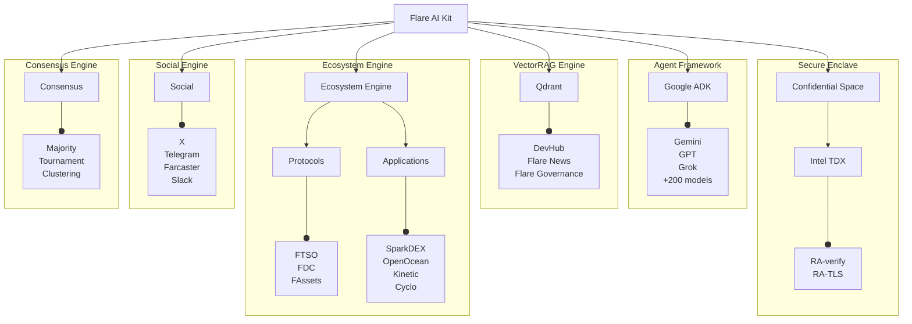

# Flare AI Kit

SDK for building **verifiable AI Agents** on Flare using Confidential Space Trusted Execution Environments (TEEs).

> [!WARNING]
>
> Flare AI Kit is currently under active development (alpha stage).
>
> Interfaces, APIs, and functionalities may change frequently and potentially in backward-incompatible ways before a stable release.
> Use with caution.

## ✨ Features

- **Verifiable execution**: Run logic inside Intel TDX TEEs via [GCP Confidential Space](https://cloud.google.com/confidential-computing/confidential-space/docs/confidential-space-overview).
- **Multi-agent consensus**: Majority/Tournament/[Consensus Learning](https://arxiv.org/abs/2402.16157) via [Google Agent2Agent](https://github.com/a2aproject/A2A) protocol.
- **Agent framework**: Built on [Google ADK](https://google.github.io/adk-docs/) with tool-calling, orchestration and evaluation.
- **Flare integration**: [FTSO](https://dev.flare.network/ftso/overview), [FDC](https://dev.flare.network/fdc/overview), [FAssets](https://dev.flare.network/fassets/overview) + ecosystem dApps ([Sceptre](https://sceptre.fi), [SparkDEX](https://sparkdex.ai), ...).
- **Social connectors**: X, Telegram, Farcaster.

## 🏗️ Architecture

The kit is composed of modular engines for agents, social feeds, onchain data, and consensus.



## 📦 Getting Started

**Prerequisites**

- [uv](https://github.com/astral-sh/uv) with Python >= 3.12
- [Docker](https://www.docker.com).
- (For deployment) Authenticated [gcloud CLI](https://cloud.google.com/sdk/docs/install).

1. **Clone & configure:**

   ```bash
   git clone --recursive https://github.com/flare-foundation/flare-ai-kit.git
   cd flare-ai-kit
   cp .env.example .env  # add API keys and settings
   ```

2. **Install:**

   ```bash
   uv sync --all-extras
   ```

## ✅ Development Checks

Run the following commands to format, lint, type-check, and test your code before committing.

```bash
# Format, lint, type-check, test
uv run ruff format && uv run ruff check --fix && uv run pyright && uv run pytest
```

## 🐳 Docker

### Running the Full SDK

```bash
docker build -t flare-ai-kit .
docker run --rm --env-file .env flare-ai-kit
```

### Running Individual Agents

The repository includes a parametric Dockerfile for running specific agents with only the dependencies they need:

```bash
# Build and run PDF agent
docker build -t fai-agent-pdf \
  --build-arg EXTRAS=pdf \
  --build-arg AGENT=ingest_pdf.py .

docker run --rm -it \
  -v "$PWD/agents/data:/app/agents/data" \
  --env-file .env \
  fai-agent-pdf
```

Available `EXTRAS`: `pdf`, `rag`, `a2a`, `ftso`, `da`, `fassets`, `social`, `tee`, `wallet`, `ingestion`

See [Docker Scripts Guide](docs/docker_scripts_guide.md) for detailed usage instructions.

## ☁️ Deploy to Confidential Space

**Prerequisites:** Authenticated [gcloud CLI](https://cloud.google.com/sdk/docs/install).

1. **Configure GCP:** Set all `GCP__*` variables in your `.env` file.

2. **Build, push to Artifacts Registry and Deploy:**

   ```bash
   chmod +x deploy-tee.sh
   ./deploy-tee.sh
   ```

## 🤝 Contributing

See [CONTRIBUTING.md](CONTRIBUTING.md).
We use Conventional Commits, Ruff/Pyright gates, and pytest.
Please include tests and update docs for any user-visible changes.

## 📜 License

This project is open-source and licensed under the Apache License 2.0. See [LICENSE](LICENSE) file.
